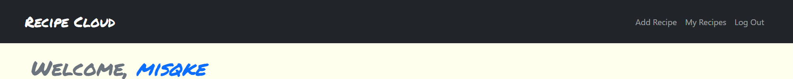

# Recipe Cloud

An online recipe book with dash of social media. Store and share your recipes, while exploring other's recipes, all in one place.

View live site [here](https://misqke-recipe-cloud.herokuapp.com).

Default image icon by [Daniel Rodriguez](https://www.iconfinder.com/DanielRT97).

---

## Features

- User recipe books - Store all your recipes in one place.
- Private option - For those old secret recipes.
- Favorites - Store other user's recipes you like.
- Comments - Try someone's recipe and love it? Let them know!

---

## How to use

visit [Recipe Cloud](https://misqke-recipe-cloud.herokuapp.com).

You can view public recipes freely, but need to be logged in to post recipes, keep favorites, or make comments.

Navigate to Sign Up page and fill out the form to sign up. After creating an account you will need to log in.

To add a recipe, navigate to the Add Recipe page and fill out the recipe form.

Click Create Recipe button and your recipe will be added! If set to public your recipe will be available for anyone to see; if private, the recipe will only be visible to you in your recipe book.

---

## To Come

A number of features to come as the app grows in users and recipes.
Some potential features include:

- Search and filtering options for recipes.
- Search options for other users.
- Friends, and friends only privacy settings.
